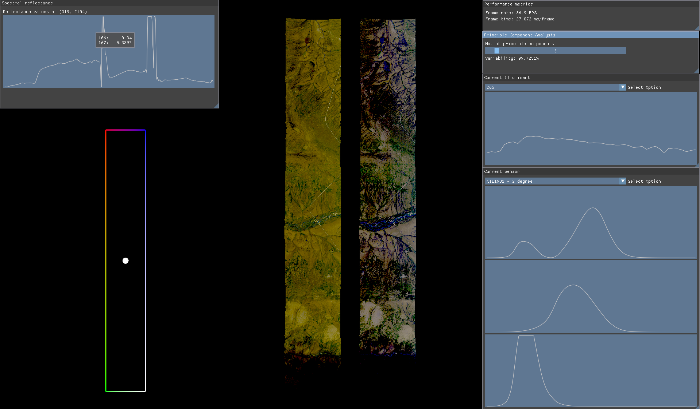

# pan: command-line tool for real-time HSI analysis

Hyperspectral datasets obtained by airborne or satellite sensors usually come in several GBs and contain up to a few hundred spectral bands. 
Preprocessing and experimenting with such datasets may impose an efficiency challenge, especially when the process demands recurrent changes 
to the input parameters. `pan` offers a GPU-accelerated solution to the problem. The tool uses Vulkan as its backend for parallel computations 
while enabling real-time visualization.



## Current features
- Supports `ENVI` file format.
- Displays spectral reflectance curve at the chosen image coordinates.
- Converts spectral reflectance to displayable sRGB values with proper gamma correction and contrast stretching.
- Switches between different illuminants and sensors SPDs in real-time.
- Reduces spectral dimension of the input image with PCA.

## Build instruction
`pan` is currently built and tested on Windows and Linux using `CMake` >= `3.22`. The tool requires Vulkan and a C++23 compiler.

First, clone the project and all its dependencies:
```
git clone https://github.com/ndming/pan.git --recursive
```

### Windows
- Install either [Visual Studio](https://visualstudio.microsoft.com/downloads/?cid=learn-onpage-download-install-visual-studio-page-cta#visual-studio-community-2022) or only its [Build Tools](https://visualstudio.microsoft.com/downloads/?cid=learn-onpage-download-install-visual-studio-page-cta#build-tools-for-visual-studio-2022), with the following components included:
    - MSVC
    - Windows 10/11 SDK
- Install the [VulkanSDK](https://vulkan.lunarg.com/sdk/home#windows) for Windows
    - Ensure that the installer has set up the `VULKAN_SDK` environment variable that points to the installation folder of the SDK
    - Ensure that the installer has added the SDK path to the `PATH` environment variable
- The project can then be configured and built with `CMake`:
```
cmake -B build -DCMAKE_BUILD_TYPE=Release
cmake --build build --config Release --target ALL_BUILD
```

### Linux
- To install the [VulkanSDK](https://vulkan.lunarg.com/sdk/home#linux), for example version `1.3.283`:
```
wget -qO- https://packages.lunarg.com/lunarg-signing-key-pub.asc | sudo tee /etc/apt/trusted.gpg.d/lunarg.asc
sudo wget -qO /etc/apt/sources.list.d/lunarg-vulkan-1.3.283-jammy.list https://packages.lunarg.com/vulkan/1.3.283/lunarg-vulkan-1.3.283-jammy.list
sudo apt update
sudo apt install vulkan-sdk
```

- Ensure the active compiler is `gcc` >= `11.4`
- The project depends on `glfw` to manage the windowing context. The library requires the following components:
```
sudo apt install libxinerama-dev libxcursor-dev xorg-dev libglu1-mesa-dev pkg-config libwayland-dev libxkbcommon-dev doxygen
```

- The project can then be configured and built with `CMake`:
```
cmake -B build -DCMAKE_BUILD_TYPE=Release
cmake --build build
```

## Usage
- To display the overall help and options:
```
pan --help
```

- Run the tool with an ENVI image:
```
pan path/to/input/file
```
